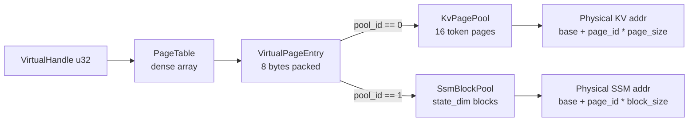

# RFC 0001: Asymmetric Virtual Memory Paging

| Field            | Value                                          |
|------------------|------------------------------------------------|
| Status           | Draft                                          |
| Author           | codepawl                                       |
| Created          | 2026-05-13                                     |
| Target milestone | M1: first concrete `MemoryPool` prototype       |
| Prerequisite     | codepawl/cachepawl#1 (initial scaffold)        |

## 1. Problem statement

Hybrid Mamba-Transformer-MoE language models such as Jamba, Zamba2, Samba,
Hymba, RecurrentGemma, and Qwen3.5 carry two structurally different cache
kinds inside the same VRAM budget. Attention layers hold variable length
KV blocks whose size scales with sequence length. State space (SSM) layers
hold fixed size hidden state whose size is independent of sequence length.
Existing production allocators force one kind into the other's shape.

Concrete failure modes the design targets:

1. **vLLM unified pool padding.** In `kv_cache_utils.py`, the function
   `unify_kv_cache_spec_page_size` rounds each cache group's page size up
   to a common multiple, then `get_max_concurrency_for_kv_cache_config`
   applies the resulting uniform multiplier across groups. On a Mamba plus
   attention model the SSM page is padded up to the attention page, and
   the concurrency estimator multiplies the per-token cost of SSM state
   (which is O(1) in tokens) as if it scaled like attention KV (which is
   O(seq_len)). vLLM issue #37121 (open, last touched 2026-05-01) reports
   a 7.3x KV cache overestimation on Qwen3.5-4B-AWQ: the engine claims
   61,776 tokens fit in 7.57 GiB while real peak is 8,447 tokens at about
   1 GiB. Effective VRAM utilization at peak: 13.7 percent.
2. **SGLang static dual pool.** `HybridReqToTokenPool` and
   `HybridLinearKVPool` (with the `MambaPool` companion class) pre allocate
   two physically isolated regions at engine start. The split is a launch
   time argument. If a deployment's mix of attention heavy and SSM heavy
   requests drifts, one region fills while the other has slack, and the
   engine cannot rebalance without a restart. No documented dynamic split
   exists in the file as of the pinned commit.
3. **TensorRT-LLM.** No released Mamba or SSM support in the public KV
   cache manager as of 2026-05-13. Treated as an inapplicable baseline,
   not a competitor.

### Targets (proposals, not predictions)

- External fragmentation ratio under 5 percent on a long mixed-shape
  trace where short and long sequences alternate, defined as
  `1 - max_contiguous_free_bytes / total_free_bytes` evaluated per pool.
- Effective KV plus SSM VRAM utilization above 90 percent on the same
  workload that vLLM issue #37121 reports at 13.7 percent.
- Allocate plus free overhead under 1 percent of a per token decode step
  on the reference machine (RTX 3060 12GB).

These are design targets, not claims about achieved numbers.

## 2. Prior art

| Approach | Pool topology | Page sizing | Fragmentation behavior | Dynamic rebalancing | Known weakness (source) |
|---|---|---|---|---|---|
| vLLM `HybridKVCacheCoordinator` | Multiple `KVCacheGroup` objects under one coordinator | Padded to a common multiple via `unify_kv_cache_spec_page_size` | Internal padding fragmentation grows with the attention to SSM page ratio | None at engine runtime | 7.3x KV overestimation on Qwen3.5 hybrids ([vllm#37121](https://github.com/vllm-project/vllm/issues/37121)) |
| SGLang `HybridReqToTokenPool` plus `HybridLinearKVPool` | Two physically isolated pre allocated regions | Per pool fixed at launch | No cross pool fragmentation; per pool OOM possible | None | Static split is a launch flag; mismatch with traffic forces a restart ([memory_pool.py L486](https://github.com/sgl-project/sglang/blob/ff70aeac3051b5f85559f382d0622716831895c8/python/sglang/srt/mem_cache/memory_pool.py#L486), [L1388](https://github.com/sgl-project/sglang/blob/ff70aeac3051b5f85559f382d0622716831895c8/python/sglang/srt/mem_cache/memory_pool.py#L1388)) |
| TensorRT-LLM | KV only | KV only | KV only | n/a | No released SSM support as of 2026-05-13 ([docs](https://nvidia.github.io/TensorRT-LLM/latest/features/kvcache.html)) |
| Cachepawl AVMP (this RFC) | Two physical pools, one virtual address space, multi resolution page table | Per pool native page size, no cross pool padding | Per pool free lists; cross pool waste tracked separately | Sequence boundary, threshold driven, coordinator initiated | Untested; v1 does not handle mid sequence rebalancing |

## 3. AVMP design

Core idea. AVMP keeps two physically heterogeneous backing slabs and
hides them behind one virtual address space. Callers receive
`VirtualHandle` values, opaque integers tagged by pool id. A page table
resolves each handle to either a fine grained KV page or a coarse SSM
block. Each pool owns its native page size, its own free list, and its
own alignment story, so neither pool pads the other. This design replaces
the single uniform page that vLLM enforces and the static partition that
SGLang locks in at launch.

### 3.1 Data structures

```
VirtualPageEntry (8 bytes, packed):
  word 0 (u32) : pool_id  (u8)  | page_id    (u24)
  word 1 (u32) : dtype    (u4)  | flags (u4) | generation (u24)
```

- `pool_id` discriminates KV pool from SSM pool. Reserved values leave
  room for a third pool kind without an entry layout change.
- `page_id` indexes inside the chosen pool. 24 bits supports up to
  16,777,216 pages per pool. At a 16 token KV page, that bounds a single
  process to about 268 million tokens of cache, well above any
  single GPU scenario.
- `dtype` is the `DType` discriminator from `src/cachepawl/quant/dtypes.py`,
  encoded in 4 bits (6 members today, 10 spare slots).
- `flags` reserves bits for shared, copy on write, and dirty markers.
- `generation` is a use after free guard. On free, the counter bumps; a
  stale handle's generation mismatches the current entry.

Pool descriptors:

- `KvPagePool` carries a single contiguous slab. Native page size is
  `kv_block_tokens * per_token_bytes`, rounded up to a 128 byte boundary
  for Triton coalesced loads. Free list is a bitmap over page indices
  plus a counter for fast occupancy queries.
- `SsmBlockPool` carries a separate contiguous slab. Native block size is
  `state_dim * bytes_per_element(dtype)`, also rounded up to 128 bytes
  and aligned so that the Mamba-2 SSD chunked kernel can address chunks
  in place (see Section 5). Free list is a circular buffer of block
  indices; the SSM access pattern is bulk reserve and bulk release per
  sequence, so a queue performs better than a bitmap.
- `PageTable` is a dense array indexed by `VirtualHandle`, holding one
  `VirtualPageEntry` per handle.

### 3.2 Address translation



The KV path resolves a per sequence handle list to a list of physical
addresses by a single base plus offset per page. The SSM path resolves
one handle per (sequence, SSM layer) to a single physical address. The
indirection is one extra load on top of the existing block table walk in
vLLM style attention kernels.

### 3.3 Alignment

| `DType`     | Element bytes | Per pool constraint |
|-------------|--------------:|---------------------|
| `FP16`      | 2             | Page size even count of elements |
| `BF16`      | 2             | Same as FP16 |
| `INT8`      | 1             | None beyond slab alignment |
| `FP8_E4M3`  | 1             | Same as INT8 |
| `FP8_E5M2`  | 1             | Same as INT8 |
| `FP4`       | 0.5 (packed)  | Page size even count of elements; pack two per byte; single element addressing not supported |

Slab base alignment is 128 bytes for every pool, matching the Triton
coalesced load width. Per page alignment within a slab is 16 bytes
minimum so a page boundary always sits on a Triton-friendly address.

### 3.4 Dynamic rebalancing

v1 scope: rebalancing happens only at sequence boundaries and never
mid step. The `HybridCacheCoordinator` polls `AllocatorStats` for each
pool between scheduler iterations. When one pool's free fraction drops
below `low_water` (proposed default 0.05) and the other pool's free
fraction is above `high_water` (proposed default 0.25), the coordinator
schedules a migration: it waits for every handle in the donor pool's
top region to release, then remaps that region as part of the recipient
pool. Worst case stall is the time to drain the longest open sequence on
the donor region; the coordinator should report this as a metric so
operators can tune the watermarks.

Mid sequence rebalancing is deferred (Section 7, question 1).

## 4. Python API sketch

The new types extend the scaffold contracts in
`src/cachepawl/allocator/base.py`,
`src/cachepawl/cache/{kv_cache,state_cache,hybrid}.py`. No existing
signatures change.

```python
from typing import Final, NewType
from cachepawl.allocator.base import Allocator, AllocatorStats
from cachepawl.cache.hybrid import HybridCacheCoordinator
from cachepawl.cache.kv_cache import KVCacheManager
from cachepawl.cache.state_cache import StateCacheManager
from cachepawl.quant.dtypes import DType

VirtualHandle = NewType("VirtualHandle", int)
INVALID_HANDLE: Final[VirtualHandle] = VirtualHandle(0)

class PhysicalAddress: ...  # opaque base plus offset

class AsymmetricPool(Allocator):
    def allocate_kv(self, num_pages: int, dtype: DType) -> list[VirtualHandle]: ...
    def allocate_ssm(self, state_dim: int, dtype: DType) -> VirtualHandle: ...
    def resolve(self, handle: VirtualHandle) -> PhysicalAddress: ...
    def per_pool_stats(self) -> tuple[AllocatorStats, AllocatorStats]: ...

class AvmpKVCacheManager(KVCacheManager):
    def __init__(self, pool: AsymmetricPool, kv_block_tokens: int) -> None: ...

class AvmpStateCacheManager(StateCacheManager):
    def __init__(self, pool: AsymmetricPool) -> None: ...

class AvmpCoordinator(HybridCacheCoordinator):
    def __init__(
        self,
        pool: AsymmetricPool,
        kv: AvmpKVCacheManager,
        ssm: AvmpStateCacheManager,
    ) -> None: ...
```

`VirtualHandle` is a `NewType` over `int`. The choice between an int
newtype and a `@dataclass(slots=True, frozen=True)` wrapper is open
(Section 7, question 2).

## 5. Kernel touchpoints

AVMP introduces one extra indirect load at the top of each kernel block:
the handle to entry to physical resolution. The inner accumulation never
sees a virtual handle.

- KV path. FlashAttention-style kernels already take a block table of
  physical indices per sequence. AVMP supplies a handle table; the kernel
  walks it through the page table once per block. The hot inner loop is
  unchanged.
- SSM path. The vLLM Mamba-2 chunked SSD kernels under
  `vllm/model_executor/layers/mamba/ops/` (`ssd_chunk_scan.py`,
  `ssd_chunk_state.py`, `ssd_combined.py`) assume chunk aligned
  addressing with a default chunk size of 256 tokens and a pad to
  `seq_len % chunk_size == 0`. `SsmBlockPool` must therefore size each
  block to a multiple of `chunk_size * bytes_per_element(dtype)` so that
  the kernel addresses chunks by stride, not by gather.
- Dispatch invariant. Kernels do not branch on `LayerKind` inside hot
  loops. The coordinator selects the kernel at launch time using
  `HybridModelSpec.layers[layer_idx].kind`; the launched kernel sees
  exactly one addressing scheme. The IBM Triton fused Mamba-2 SSD
  kernel is therefore untouched; AVMP only adds entry resolution
  outside it.

## 6. Validation strategy

Microbenchmarks first, models later. Every microbenchmark below runs on
an RTX 3060 12GB with no model dependency.

| Metric | Definition | Workload |
|---|---|---|
| Allocate latency | Wall time per `allocate_kv` or `allocate_ssm`, averaged over N=10,000 ops | Single threaded loop |
| Free latency | Wall time per `free`, averaged over N=10,000 ops | Same loop, post fill |
| External fragmentation | `1 - max_contiguous_free / total_free` per pool | Adversarial trace: alternating 16 token and 16K token KV reservations plus mixed SSM reservations |
| L2 cache hit proxy | Achieved bandwidth on a strided read over the resolved physical pages, divided by HBM peak | 1 GB working set, stride matched to handle resolution |
| Peak VRAM | Max VRAM occupied during the trace | 8 to 16 concurrent sequences, 8K to 64K context |

Comparison harness. Two baseline allocators are implemented inside
Cachepawl as additional `Allocator` subclasses:

- `PaddedUniformAllocator` mimics the vLLM unified pool. SSM state is
  rounded up to the KV page size. The harness runs the same workload
  trace and reports the same metrics.
- `FixedDualPoolAllocator` mimics the SGLang static dual pool. The
  attention to SSM split is a constructor argument, frozen for the run.

All three allocators run the same dummy workload trace. Output is keyed
by (allocator, workload, seed) so revisions can be diffed without
rerunning the baseline.

The comparison harness now ships in
[`src/cachepawl/benchmarks/compare/`](../../src/cachepawl/benchmarks/compare/)
with a CLI at `python -m cachepawl.benchmarks.compare`. A 3-cell
`--quick` reference run on CPU is committed under
[`benchmarks/results/baseline/quick/`](../../benchmarks/results/baseline/quick/);
see `report.md` for the rendered comparison. Headline numbers AVMP must
beat:

| variant | fragmentation_during_load | fragmentation_peak | oom_count |
|---|---|---|---|
| padded_unified  | 0.682 | 0.995 |   0 |
| fixed_dual_mr05 | 0.202 | 0.961 |   5 |
| fixed_dual_mr09 | 0.219 | 0.969 | 247 |

AVMP wins if it lands closer to the fixed_dual fragmentation column
while staying at or below the padded_unified OOM column, on the same
workload and pool budget. The "Data sanity invariants" section of
`benchmarks/README.md` is the regression net every new allocator must
pass before its numbers are trusted.

## 7. Open questions

These need resolution before AVMP code lands. Reviewer focus belongs
here.

1. **Mid sequence SSM growth under speculative decoding.** Speculative
   decoding can branch a sequence mid step. A spawned branch needs an
   SSM checkpoint while the parent still holds the original block. What
   is the copy on write story for `SsmBlockPool`: lazy clone on first
   write, eager clone at branch creation, or a refcount on the entry
   itself?
2. **`VirtualHandle` as `NewType(int)` vs `@dataclass(slots=True, frozen=True)`.**
   The int form is a single integer at runtime and traces cleanly through
   `torch._dynamo`. The dataclass form gives static field access typing
   but may force `torch.compile` to opaque object handling. Which side
   wins under realistic compile graphs?
3. **Cross stream rebalancing without decode stall.** If rebalancing is
   issued on a control stream while decode kernels run on the compute
   stream, how is ordering guaranteed without a stream sync? Candidates:
   CUDA events on each affected block, migration on a third stream with
   a producer consumer event chain, or a per page generation bump
   visible from inside the kernel.
4. **Combined layer handles (Hymba style parallel attention plus SSM).**
   A Hymba layer touches both pools per step. Should one virtual handle
   span both pools (one `VirtualPageEntry` carries two physical
   pointers), or should the layer hold two handles (one per pool)? The
   single handle option simplifies per layer step accounting but
   complicates the entry layout.
5. **Mixed dtype quantization within one sequence.** If the system
   migrates older tokens to FP8 while keeping recent tokens FP16 inside
   the same sequence, the page table must store dtype per entry, not
   per handle. The current 4 bit `dtype` field already allows this.
   Open question is whether the manager API should expose per page
   dtype migration as a first class operation.
6. **Prefix caching with SSM checkpoints.** vLLM prefix caching keys by
   token hash. SSM state is a recurrence and cannot be split by token
   range. Should AVMP support shared SSM checkpoints across sequences
   that share a prefix, or accept that prefix sharing applies only to
   the KV path?
7. **`AllocatorStats` cardinality.** The scaffold's `AllocatorStats` has
   one fragmentation number. AVMP exposes per pool external
   fragmentation and a cross pool waste figure. Options: extend
   `AllocatorStats`, return a richer subtype, or add
   `AsymmetricPool.per_pool_stats` (sketched in Section 4) and keep
   `stats()` aggregated.

## 8. Non goals for v1

Out of scope for the first AVMP milestone. Each item is a future RFC,
not a deferred TODO.

- Cross GPU sharing of cache state.
- CPU offload of cold KV or SSM blocks.
- Disk offload of any kind.
- Speculative decoding cache reuse beyond the basic branch case in
  question 1 above.
- Quantization aware compression sweeps that rewrite already allocated
  pages in place.
- Multi tenant isolation across processes. AVMP assumes one process,
  one pool pair.

## 9. References

All GitHub permalinks are pinned to a commit hash and were verified to
resolve on 2026-05-13.

- vLLM `HybridKVCacheCoordinator`:
  [`vllm/v1/core/kv_cache_coordinator.py` L392](https://github.com/vllm-project/vllm/blob/0f69128a3773a2c622d958631c9fde8d68a467d8/vllm/v1/core/kv_cache_coordinator.py#L392).
- vLLM `unify_kv_cache_spec_page_size`:
  [`vllm/v1/core/kv_cache_utils.py` L1009](https://github.com/vllm-project/vllm/blob/0f69128a3773a2c622d958631c9fde8d68a467d8/vllm/v1/core/kv_cache_utils.py#L1009).
- vLLM `get_max_concurrency_for_kv_cache_config`:
  [`vllm/v1/core/kv_cache_utils.py` L874](https://github.com/vllm-project/vllm/blob/0f69128a3773a2c622d958631c9fde8d68a467d8/vllm/v1/core/kv_cache_utils.py#L874).
- vLLM issue #37121, KV cache 7.3x overestimation on Qwen3.5 hybrids,
  opened 2026-03-15, updated 2026-05-01:
  [`vllm-project/vllm#37121`](https://github.com/vllm-project/vllm/issues/37121).
- SGLang `HybridReqToTokenPool`:
  [`python/sglang/srt/mem_cache/memory_pool.py` L486](https://github.com/sgl-project/sglang/blob/ff70aeac3051b5f85559f382d0622716831895c8/python/sglang/srt/mem_cache/memory_pool.py#L486).
- SGLang `HybridLinearKVPool`:
  [`python/sglang/srt/mem_cache/memory_pool.py` L1388](https://github.com/sgl-project/sglang/blob/ff70aeac3051b5f85559f382d0622716831895c8/python/sglang/srt/mem_cache/memory_pool.py#L1388).
- SGLang `MambaPool`:
  [`python/sglang/srt/mem_cache/memory_pool.py` L194](https://github.com/sgl-project/sglang/blob/ff70aeac3051b5f85559f382d0622716831895c8/python/sglang/srt/mem_cache/memory_pool.py#L194).
- vLLM Mamba-2 SSD chunked kernels (entry, chunk scan, chunk state):
  [`ssd_combined.py`](https://github.com/vllm-project/vllm/blob/0f69128a3773a2c622d958631c9fde8d68a467d8/vllm/model_executor/layers/mamba/ops/ssd_combined.py),
  [`ssd_chunk_scan.py`](https://github.com/vllm-project/vllm/blob/0f69128a3773a2c622d958631c9fde8d68a467d8/vllm/model_executor/layers/mamba/ops/ssd_chunk_scan.py),
  [`ssd_chunk_state.py`](https://github.com/vllm-project/vllm/blob/0f69128a3773a2c622d958631c9fde8d68a467d8/vllm/model_executor/layers/mamba/ops/ssd_chunk_state.py).
- Mamba-2 paper, Dao and Gu 2024:
  [arXiv:2405.21060v1](https://arxiv.org/abs/2405.21060v1).
- IBM Research, Triton in Action: real world optimizations for Mamba2
  and vLLM, Triton Developer Conference 2025:
  [research.ibm.com publication page](https://research.ibm.com/publications/triton-in-action-real-world-optimizations-for-mamba2-and-vllm).
- PyTorch blog, Accelerating Mamba2 with kernel fusion:
  [pytorch.org/blog](https://pytorch.org/blog/accelerating-mamba2-with-kernel-fusion/).
- TensorRT-LLM KV cache documentation:
  [nvidia.github.io/TensorRT-LLM features/kvcache](https://nvidia.github.io/TensorRT-LLM/latest/features/kvcache.html).
- Cachepawl scaffold PR: codepawl/cachepawl#1.

Sibling design docs that frame the broader tradeoff space:
[`docs/architecture.md`](../architecture.md) and
[`docs/design-rationale.md`](../design-rationale.md).
