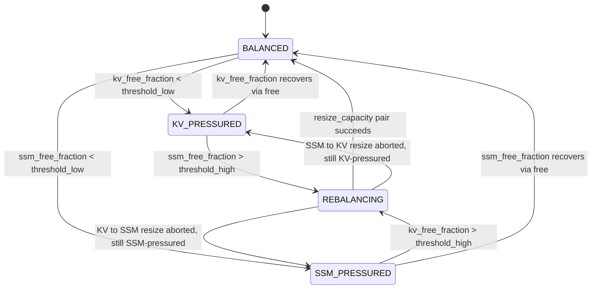

# RFC 0002: Dynamic Pool Rebalancing (AVMP v2)

| Field            | Value                                                                  |
|------------------|------------------------------------------------------------------------|
| Status           | First-pass implementation complete; success criterion DID NOT PASS     |
| Author           | codepawl                                                               |
| Created          | 2026-05-16                                                             |
| Target milestone | AVMP v2                                                                |
| Prerequisite     | PR #9 merged on `main` (commit `bf93766`)                              |
| Extends          | RFC 0001 section 3.4 (dynamic rebalancing, deferred from v1)           |
| v1 prototype     | `avmp_static_mr05` variant, frozen at PR #9                            |
| Implementation   | Three sub-PRs landed: sub-PR 1 (PR #11), sub-PR 2 (PR #12), sub-PR 3 (this PR) |
| Sweep data       | [`benchmarks/results/avmp-v2/full/`](../../benchmarks/results/avmp-v2/full/) (sub-PR 3, 789.3 cross-workload OOMs); [`benchmarks/results/avmp-v2-r2/full/`](../../benchmarks/results/avmp-v2-r2/full/) (sub-PR 4, 786.3 cross-workload OOMs). Both 270 cells, cpu (linux x86_64) |
| Sub-PR 3 verdict | DID NOT PASS section 3 strict criterion. avmp_dynamic_mr05 cross-workload `total_oom` = 789.3 vs `min(fixed_dual_mr05, fixed_dual_mr09)` = 784.7. Diagnosed: trigger placement at post-allocate hook missed OOM-prone code paths; throttle used `time.monotonic_ns` (RFC §8 q5) |
| Sub-PR 4 verdict | Pre-registered C1 stop-condition holds: avmp_dynamic_mr05 strictly wins on 2 workloads (uniform_short 7.0 < 7.3; agentic_burst 220.7 < 227.3). mixed_long regresses (+8.7 OOMs). C2 (cross-workload >= 5% improvement) does NOT hold (0.4% gained). Verdict: CONTINUE. Determinism contract resolved for the deterministic JSON subset |
| Sub-PR 5 GPU     | RTX 3060, CUDA 13, 4 GiB cap (AVMP 2x footprint). Sweep at [`benchmarks/results/avmp-v2-gpu/full/`](../../benchmarks/results/avmp-v2-gpu/full/), 180 cells. C1 confirmed on GPU on the SAME two workloads (uniform_short, agentic_burst). C3 (peak_reserved win) does NOT hold for AVMP given the 2x footprint design (avmp peaks at 9216 MiB vs baselines at 5120 MiB on 4 GiB cells). GPU CONFIRMS the CPU verdict. Determinism: counters byte-identical, float metrics drift up to 77.8% across runs (torch caching allocator state, not allocator logic) |
| Sub-PR 6 stage 1 | migration_batch_size sweep on GPU, 12 variants (3 baselines + 9 batch sizes 1..256), 432 cells, 29:21 wall. Sweep at [`benchmarks/results/avmp-v2-batchsize-sweep/`](../../benchmarks/results/avmp-v2-batchsize-sweep/). Best per workload: uniform_short b4 (6.7 vs fd05 7.3, -0.7); mixed_long b128 (364.3 vs fd05 387.3, **-23.0**, regression CLOSED); agentic_burst b256 (136.0 vs fd05 157.3, -21.3). Cross-workload best: avmp_dynamic_b256 = 509.3 OOMs (35.5% improvement vs PR #13 baseline 789.3). C2 PASSED. Hypothesis (batch_size is the right knob) CONFIRMED. See [`stage1_analysis.md`](../../benchmarks/results/avmp-v2-batchsize-sweep/stage1_analysis.md). Verdict: CONTINUE |
| Sub-PR 7 stage 2 | threshold sweep at fixed migration_batch_size=128 on GPU, 7 variants (3 baselines + 4 threshold variants: th_high in {0.10, 0.20}, th_low in {0.02, 0.10}), 252 cells, 19:47 wall. Sweep at [`benchmarks/results/avmp-v2-threshold-sweep/`](../../benchmarks/results/avmp-v2-threshold-sweep/). Pre-registered Hypotheses A (lower threshold_high helps mixed_long) and B (lower threshold_low helps uniform_short/agentic_burst) both FALSIFIED: all four threshold variants tie with stage 1 `avmp_dynamic_b128` at total_oom = 510.0; rebalance_count and bytes_migrated_total are byte-identical across all four. Pre-registered stop rule (<= 494.0 for "materially better") NOT met. Determinism: 36/36 cells byte-identical on logical counters across rerun. See [`stage2_analysis.md`](../../benchmarks/results/avmp-v2-threshold-sweep/stage2_analysis.md). Verdict: MARGINAL. Paper config remains stage 1 `avmp_dynamic_b128` |
| Paper draft      | Deferred. Gated on a strict-criterion-passing v2 sweep                 |

## 1. Relationship to RFC 0001

This RFC extends section 3.4 of RFC 0001, which sketched dynamic rebalancing and deferred it from v1. The static AVMP design from RFC 0001 sections 3.1 through 3.3 stays unchanged: two physical pools, two native page sizes, virtual handles opaque to kernels. v2 adds a coordinator that moves capacity between the two pools when one pool runs out while the other has slack. RFC 0001's stated v1 invariants (separate KV and SSM physical stores, immutable per-pool native page sizes, opaque virtual handles) are preserved; v2 mutates pool *capacity* but not pool *kind*.

## 2. Problem statement

The 216-cell sweep committed at [`benchmarks/results/avmp-v1-preview/full/report.md`](../../benchmarks/results/avmp-v1-preview/full/report.md) shows that no static partition wins on every workload. The cross-workload summary (lines 104 to 109 of that file) reads:

| variant | mean_frag_during_load | mean_frag_peak | total_oom | total_kv_free_MiB | total_ssm_free_MiB |
| --- | --- | --- | --- | --- | --- |
| avmp_static_mr05 | 0.319 | 0.992 | 784.7 | 39936.000 | 39936.000 |
| fixed_dual_mr05  | 0.319 | 0.992 | 784.7 | 39936.000 | 39936.000 |
| fixed_dual_mr09  | 0.481 | 0.987 | 1507.3 | 7986.750 | 71875.500 |
| padded_unified   | 0.760 | 0.998 | 1826.3 | 0.000 | 0.000 |

Two rigidity signals are visible.

First, `fixed_dual_mr09` records 256.7 OOMs on `uniform_short` with `jamba_1_5_mini` at the 1 GiB budget (line 29 of [`report.md`](../../benchmarks/results/avmp-v1-preview/full/report.md)). The accompanying end-of-run snapshot for that row is `kv_free_MiB = 102.375`, `ssm_free_MiB = 921.500`: the engine OOMs on KV pressure while roughly nine-tenths of the budget sits idle in the SSM pool it cannot reach. The cross-workload total of 71875.5 MiB stranded SSM bytes (line 108) is the same signal aggregated.

Second, `fixed_dual_mr05` and `avmp_static_mr05` produce identical OOM and fragmentation numbers per cell (compare lines 24 and 36 of [`report.md`](../../benchmarks/results/avmp-v1-preview/full/report.md), and `total_oom = 784.7` for both in the cross-workload summary). Static AVMP is at byte parity with the static dual-pool baseline; the v1 prototype demonstrates the virtual-handle layer is cost-free but not yet value-additive. v2 is where AVMP's virtual layer earns its keep.

### Success criterion

> AVMP v2 must achieve `total_oom <= min(fixed_dual_mr05.total_oom, fixed_dual_mr09.total_oom)` on every workload in the default 216-cell sweep, with the v2 variant's configured `total_bytes` not exceeding any baseline variant's configured `total_bytes`. Determinism contract: with `rebalance_enabled=False` the v2 implementation reproduces the `avmp_static_mr05` row of `aggregated_deterministic.json` byte-identically.

The contract is parity-or-better against the strictly better static baseline per workload, not zero OOMs. Residual OOMs are expected when a single burst exceeds the configured budget outright; the rebalancing mechanism cannot manufacture bytes.

Hardware caveat. The numbers above were measured on `cpu (linux x86_64)` with torch `2.12.0+cu130`, cuda `13.0`, numpy `2.2.6`, python `3.10.19`, sweep git SHA `afa8ae7`, wall time 2201.15 s, 216 of 216 cells succeeded ([`SWEEP_METADATA.json`](../../benchmarks/results/avmp-v1-preview/full/SWEEP_METADATA.json)). Latency columns are machine-dependent; the OOM and fragmentation columns are part of the deterministic subset that PR #9 verified byte-identical across two independent runs.

## 3. Design space

Three alternatives were considered.

### 3.1 Alt A: Threshold-triggered repartition

Maintain per-pool free-fraction watermarks `threshold_low` and `threshold_high`. When the pool the current `allocate` call targets raises `CapacityError` *and* the other pool's free fraction exceeds `threshold_high`, schedule a one-batch capacity migration from the slack pool to the pressured pool. Trigger evaluation happens only on the existing CapacityError path inside `_try_bulk_allocate_with_eviction` (see `src/cachepawl/allocator/avmp/pool.py:217-225`); the hot path stays a single attempted allocate.

- Migration cost: `migration_batch_size * donor_native_unit_bytes` per event, single-digit MiB at the proposed default.
- Worst-case `allocate()` latency: one extra `_evict_one`-cost equivalent plus a single shrink-grow pair, only on the path that was already going to OOM.
- In-flight handles: migration only touches the donor pool's high end; live handles in that region block migration (the resize call returns False and the original OOM is re-raised). No handle is invalidated mid-call.
- Complexity: roughly 150 to 300 LoC across pool, physical, page_table, plus the stats schema additions. One new state machine.
- Testability: deterministic when `rebalance_enabled=False`; under `rebalance_enabled=True` the trigger is workload-driven, so synthetic alternating workloads exercise it without sampling tricks.

### 3.2 Alt B: Continuous proportional rebalancing

Track an exponential moving average of per-pool allocate demand. After each allocate call, compute the implied target ratio; if it diverges from the current ratio by more than a tolerance, migrate toward target.

- Migration cost: higher, because rebalancing fires even when neither pool is pressured.
- Worst-case `allocate()` latency: every allocate pays the EMA update and tolerance check.
- Complexity: one state machine plus an EMA tracker plus a tolerance knob; more oscillation failure modes.
- Testability: harder to write a deterministic regression test because EMA state is path-dependent.

Deferred: the capacity v2 needs only matters on the CapacityError branch. Alt A's lazy trigger gives the same recovery without paying on the happy path.

### 3.3 Alt C: Reservation-based with lazy migration

Collapse the two physical stores into one slab. Advertised KV and SSM capacities become bookkeeping caps over a single allocator. Rebalancing is then a cap-adjustment with no physical migration.

- Migration cost: zero bytes moved.
- Worst-case `allocate()` latency: same as static.
- In-flight handles: trivially unaffected.
- Complexity: requires the unified backing store to support both native page sizes simultaneously, which collides with RFC 0001 section 3.1's per-pool native size invariant. Closest to the "multi-resolution page table" idea RFC 0001 leaves out of scope.
- Testability: would require redesigning v1's store separation; the existing `avmp_static_mr05` byte-identity contract breaks.

Deferred: v1's two-store separation was an explicit design choice (RFC 0001 line 69, "two physically heterogeneous backing slabs"). Reopening it is a separate RFC.

### 3.4 Decision

Pick Alt A. It is the design RFC 0001 section 3.4 already sketched (low_water 0.05, high_water 0.25, donor-pool top-region remap). v2's contribution is detail, testability, and observability, not novelty of the trigger choice. Alt B and Alt C stay on the deferred list for follow-up RFCs.

## 4. Detailed design

### 4.1 State machine



State is recomputed only on the CapacityError branch and on `free` (which can move the pool back to BALANCED). Steady-state allocate calls never read the state.

### 4.2 Trigger thresholds

- `threshold_low = 0.05`, mirroring RFC 0001 section 3.4's proposed default.
- `threshold_high = 0.30`, slightly above RFC 0001's `high_water = 0.25` to leave headroom and reduce thrash (see section 8 question 3).
- Thresholds are constructor params; no auto-tuning in v2 (see section 9).

### 4.3 Migration mechanics

Migration moves capacity, not live data. The donor pool shrinks at its high end; the recipient pool grows at its high end. Native unit sizes stay fixed.

SSM to KV example. Let `BS = SSMBlocksStore.block_size_bytes` and `PS = KVPagesStore.page_size_bytes`, both derived from `HybridModelSpec` at construction.

- Donor SSM shrinks by `migration_batch_size * BS` bytes.
- Recipient KV grows by `floor((migration_batch_size * BS) / PS) * PS` bytes.
- Wasted bytes per migration: `(migration_batch_size * BS) mod PS`. Surfaced as `bytes_wasted_to_alignment_total` in stats.

KV to SSM is the mirror. The donor's resize is committed only if its high-end region contains no live handle; otherwise the resize returns False and the original OOM is re-raised.

### 4.4 Proposed physical-store API additions

Two new methods per physical store. v1 has neither (see `src/cachepawl/allocator/avmp/physical.py:44-112` for `KVPagesStore` and lines 114 to 172 for `SSMBlocksStore`). Both are DESIGN, not implementation; the v2 sub-PRs introduce them.

```python
class KVPagesStore:
    def resize_capacity(self, delta_bytes: int) -> bool: ...

class SSMBlocksStore:
    def resize_capacity(self, delta_bytes: int) -> bool: ...
```

Pre-condition for shrinking (`delta_bytes < 0`): the high-end region targeted for release must contain no live page or block. Implementation walks the free list backwards; if a used slot intervenes, returns False. Growing (`delta_bytes > 0`) succeeds when the underlying `torch.empty` for the extension succeeds; failure returns False.

`VirtualPageTable` is unchanged. v1 has no in-place remap (see `src/cachepawl/allocator/avmp/page_table.py:62,103,118`); the pool uses a remove + mint cycle on relocated handles, so each migrated handle gets a fresh id. Section 8 question 7 covers the id-monotonicity implication for external callers.

### 4.5 Concurrency

The Python prototype is single-threaded. Calls into `allocate`, `free`, and the internal `_try_rebalance` serialize naturally. The design records (but does not implement) that a future Triton-backed pool would require a write barrier between the donor and recipient `resize_capacity` calls and any concurrent allocate that observes the new capacity. The two `resize_capacity` calls must be ordered, donor first, with a single visible commit point; otherwise an allocate threading between them could observe a transiently shrunk donor and an unchanged recipient and incorrectly raise OOM.

### 4.6 Failure modes

- `resize_capacity` returns False on the donor: no state changes. Re-raise the original OOM as if rebalance had not fired. Increment `rebalance_aborted_count`.
- Donor resize succeeds, recipient resize fails: revert donor (call its `resize_capacity` with the inverse delta). Re-raise the original OOM. Increment `rebalance_aborted_count`.
- Mid-migration crash in the Python prototype: fatal. No journal. Future Triton work would need a recovery log; out of scope here (see section 9).

### 4.7 Observability

Five new stats fields in `get_allocator_stats` (the v1 schema lives at `src/cachepawl/allocator/avmp/pool.py:172-189`):

- `rebalance_count`: successful migrations.
- `rebalance_aborted_count`: triggers that did not complete (live-handle block on donor, or recipient resize fail).
- `bytes_migrated_total`: cumulative donor bytes shrunk plus recipient bytes grown; useful for thrash detection.
- `time_spent_rebalancing_ns`: cumulative wall time across all rebalance calls.
- `bytes_wasted_to_alignment_total`: the `mod` residue described in section 4.3.

Two existing fields, `kv_pool_bytes` and `ssm_pool_bytes`, become time-varying in v2; they are renamed `current_kv_pool_bytes` and `current_ssm_pool_bytes` to flag the semantics change. This is the one non-additive stats change in v2.

## 5. API surface

`AsymmetricVirtualPool.__init__` gains four optional params, all after the existing v1 params so call sites that pass positionally do not break:

```python
def __init__(
    self,
    model_spec: HybridModelSpec,
    total_bytes: int,
    device: torch.device,
    mamba_ratio: float = 0.5,
    attention_page_tokens: int = 16,
    eviction: EvictionPolicy = EvictionPolicy.LRU,
    rebalance_enabled: bool = True,
    threshold_low: float = 0.05,
    threshold_high: float = 0.30,
    migration_batch_size: int = 1,
) -> None: ...
```

`migration_batch_size = 1` keeps migration cost predictable and the `mod`-residue waste bounded. Larger batches are a tuning sub-PR follow-up, not v2 scope.

`allocate()` and `free()` signatures are unchanged. The determinism contract (section 2) requires that constructing with `rebalance_enabled=False` reproduces v1's `avmp_static_mr05` row of `aggregated_deterministic.json` byte-identically; sub-PR 3 includes a regression that checks the SHA-256 against `b792e500c486bd3efc7695486e0c9eb2460e2aeab0bc2923708e74f62aa957f2`, recorded in PR #9's [`SWEEP_METADATA.json`](../../benchmarks/results/avmp-v1-preview/full/SWEEP_METADATA.json) `determinism_check.result`.

## 6. Test strategy

- **Unit test for the migration primitive.** Construct a small pool, fill it asymmetrically, call `_test_only_rebalance(direction, num_blocks)`, assert state transitions BALANCED to REBALANCING to BALANCED and `bytes_migrated_total > 0`.
- **Synthetic alternating workload.** A new sweep fixture alternates KV-heavy and SSM-heavy bursts inside one cell, sized to force at least three BALANCED-PRESSURED-REBALANCING cycles per replicate. The cell asserts `rebalance_count >= 3` post-run.
- **Stateful hypothesis extension.** Extend `tests/unit/allocator/stateful/test_avmp_stateful.py` with a `@rule` that calls `_test_only_rebalance` at random valid times and an `@invariant` that `bytes_migrated_total` is monotonically non-decreasing across all rules.
- **Static-mode regression.** With `rebalance_enabled=False`, the deterministic subset of `aggregated.json` for `avmp_static_mr05` must hash-match the committed `aggregated_deterministic.json` filtered to that variant (SHA-256 above).
- **End-to-end target.** A new `avmp_dynamic_mr05` variant runs the full 216-cell sweep. The variant's per-workload `total_oom` is compared against `min(fixed_dual_mr05.total_oom, fixed_dual_mr09.total_oom)` per workload; the section 2 success criterion is the pass condition for merging sub-PR 3.

Target-margin rationale: the success criterion is parity-or-better, not zero OOMs, because some bursts in the workload library exceed the configured `total_bytes` outright (for example `mixed_long` at `total_bytes=1gib`: every variant including `padded_unified` records at least 101.3 OOMs on that cell, see line 46 of [`report.md`](../../benchmarks/results/avmp-v1-preview/full/report.md)). Rebalancing reduces stranding, not gross capacity.

## 7. Implementation plan (three sub-PRs)

Each sub-PR is independently mergeable and individually green on ruff, mypy, and pytest.

- **Sub-PR 1: API and observability.** State machine, stats schema with the five new fields, `rebalance_enabled` flag. The REBALANCING state is unreachable in this PR; `_try_rebalance` is a no-op that always returns False. The PR validates the API surface and unblocks downstream callers. Regression: `avmp_static_mr05` byte-identity holds trivially because the no-op path matches v1 behavior.
- **Sub-PR 2: Migration mechanics.** Adds `resize_capacity` to both stores and `_test_only_rebalance` to the pool. No trigger logic; `_try_rebalance` still returns False on the OOM path. Validates that migration is correct in isolation via the unit test from section 6.
- **Sub-PR 3: Trigger and end-to-end.** Wires the trigger into the CapacityError branch, registers `avmp_dynamic_mr05` as a sweep variant, regenerates and commits the full 216-cell sweep at `benchmarks/results/avmp-v2/full/`. The PR is held until the section 2 success criterion holds on the committed data.

## 8. Risks and open questions

These are v2-specific. Reviewer focus belongs here, especially items 1, 3, and 5.

1. **Eviction-rebalance contention.** The LRU evictor in `_evict_one` and the rebalancer both target the donor pool's high end. If both fire on the same allocate-OOM event, sequencing matters. Proposal: evict first; rebalance only if eviction does not free enough capacity. Needs concrete sequencing in sub-PR 3.
2. **Per-workload threshold tuning.** Whether `threshold_low` and `threshold_high` should be per-workload constants or one global pair. Proposal: one global pair in v2, mark per-workload tuning as a follow-up RFC.
3. **Migration thrashing.** A workload that oscillates KV-heavy and SSM-heavy faster than the watermarks settle could rebalance on every allocate. Proposal: hysteresis via `min_rebalance_interval_calls` defaulting to a few hundred, surfaced as a stats field. Not in v2 scope, but the API surface must not preclude it.
4. **Stats sampling consistency during REBALANCING.** Between donor shrink and recipient grow, the sum `current_kv_pool_bytes + current_ssm_pool_bytes` is transiently less than `total_bytes`. External readers that assume sum-conservation see a violation. Proposal: document the invariant as eventually-consistent and add a stats-sampling test that allows transient violation inside the REBALANCING state only.
5. **Determinism under rebalancing.** The trigger fires on the CapacityError branch, whose timing depends on allocation order. Two runs with the same seed should produce the same trigger sequence, but minor harness reordering could perturb it. Proposal: gate the determinism guarantee on `rebalance_enabled=False`; do not claim byte-identity for v2 dynamic runs in the README or `SWEEP_METADATA.json`.
6. **Rebalance vs eviction race for a soon-to-be-freed block.** If the LRU evictor selects block B for eviction and the rebalancer wants to release B as part of donor shrink, the operations conflict. Proposal: serialize eviction before rebalance (resolves question 1 as well).
7. **VirtualPageTable handle-id monotonicity under remove + mint.** Migrated handles get fresh ids; the id space grows faster than v1. External callers that assume id density (no holes, monotone counter close to live-handle count) break. Proposal: document the change in the RFC and update the handle-id docstring in sub-PR 1.
8. **Future Triton concurrency.** The design must not preclude a write-barrier-based serialization between donor and recipient `resize_capacity` calls. Section 4.5 records the constraint; the Python prototype does not enforce it.

## 9. Non-goals for v2

Each is a future RFC or an acknowledged limitation.

- Cross-GPU rebalancing.
- CPU offload as a third pool tier.
- Predictive rebalancing (ML-based or trace-based).
- Auto-tuning of `threshold_low` and `threshold_high`.
- Triton kernel integration; the existing kernel-touchpoints story from RFC 0001 section 5 carries forward unchanged.
- Mid-sequence rebalancing. RFC 0001 section 3.4 explicitly defers this; v2 keeps the deferral.
- Multi-resolution page table (Alt C above).
- Recovery journal for mid-migration crashes.

## 10. Paper alignment

When the v2 paper draft starts (after sub-PR 3 produces measured numbers), the section mapping is mechanical, not creative:

- Method 3.1: section 2 (problem statement, including the rigidity table).
- Method 3.2: section 3 (design space, alternatives).
- Method 3.3: section 4 (detailed design, state machine, migration mechanics).
- Evaluation 4.1: section 6 (test strategy and success criterion).
- Discussion / Limitations: section 8 (open questions) and section 9 (non-goals).

No paper draft is included in this RFC; that work is gated on sub-PR 3 landing with measured numbers.

## 11. References

RFC 0001 and the v1 sweep:

- RFC 0001, this repo, especially section 3.4: [`docs/designs/0001-asymmetric-virtual-memory-paging.md`](./0001-asymmetric-virtual-memory-paging.md).
- v1 full sweep report: [`benchmarks/results/avmp-v1-preview/full/report.md`](../../benchmarks/results/avmp-v1-preview/full/report.md).
- v1 sweep metadata (hardware, versions, determinism SHA-256): [`benchmarks/results/avmp-v1-preview/full/SWEEP_METADATA.json`](../../benchmarks/results/avmp-v1-preview/full/SWEEP_METADATA.json).

External prior art (links verified during drafting on 2026-05-16):

- SGLang `--mamba-full-memory-ratio`, default 0.9, no runtime adjustment: [hyperparameter_tuning.md](https://github.com/sgl-project/sglang/blob/main/docs/advanced_features/hyperparameter_tuning.md).
- SGLang unified-pool feature request (open as of drafting): [sgl-project/sglang#10723](https://github.com/sgl-project/sglang/issues/10723).
- SGLang auto-tuner roadmap: [sgl-project/sglang#13363](https://github.com/sgl-project/sglang/issues/13363).
- PyTorch `expandable_segments` (allocator-level virtual-segment growth; relates conceptually to dynamic capacity but operates one layer below pool-level rebalancing): [vLLM optimization docs](https://docs.vllm.ai/en/stable/configuration/optimization/).
- LeoAM, adaptive KV chunk management on a single commodity GPU: [arXiv:2506.20187](https://arxiv.org/abs/2506.20187).
- Apt-Serve, adaptive request scheduling on hybrid cache: [arXiv:2504.07494](https://arxiv.org/abs/2504.07494).
- Survey on KV cache management for LLM acceleration: [arXiv:2412.19442](https://arxiv.org/abs/2412.19442).
